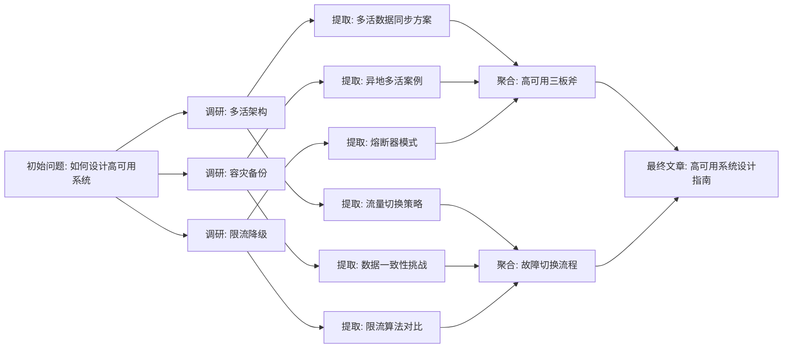

# 第 04 讲 | 当 ReAct 不够用：进阶范式与选型决策

> **本节我们将掌握**：
>
> - Tree of Thoughts（ToT）和 Graph of Thoughts（GoT）的机制与代价
> - 为什么 AutoGPT 范式在工业落地中降温了
> - 2026 年的新玩家：OpenAI Agents SDK、PydanticAI
> - 一张决策表：从任务特征到范式选型

---

## 为什么线性推理不够用

第 03 讲的三种基础范式，推理路径都是线性的——ReAct 是一条链，Plan-and-Execute 是一条带分支的链，Reflexion 是链外面套了个环。

但有些任务的解空间不是线性的：

- 创意写作：开头有 10 种写法，每种导向不同的故事走向
- 架构设计：方案 A 和方案 B 各有优劣，需要并行评估再合并
- 数学证明：一条路走不通要回溯，多条路可能汇聚到同一个结论

这时候需要**"树"**和**"图"**。

---

## ToT: Tree of Thoughts（多路径推理）

ToT 把 CoT 的"一条链"升级成"一棵树"。

### 它怎么工作

> **场景**：AI 写一个短篇小说，题目是《最后一班地铁》。要求有反转，结尾出人意料。

```
── Level 0：展开 3 个故事开头 ──────────────────────────
开头 A: 主角在空荡的地铁站等车，发现末班车已经开走了
开头 B: 主角赶上了末班车，但车厢里只有一个人
开头 C: 主角发现地铁时刻表上多了一班不存在的列车

── Level 1：每个开头展开 3 个发展方向，打分剪枝 ────
开头 A 的发展:
  A1: 主角走路回家，路上遇到各种奇遇 → 评分 3/10（太平淡）→ 剪枝
  A2: 主角发现末班车其实没开走，是站牌坏了 → 评分 6/10 ✓ 保留
  A3: 主角叫了网约车，司机是旧识 → 评分 4/10（不够反转）→ 剪枝

开头 B 的发展:
  B1: 那个人是鬼 → 评分 2/10（太俗套）→ 剪枝
  B2: 那个人是未来的自己 → 评分 8/10 ✓ 保留
  B3: 那个人是地铁工作人员 → 评分 3/10 → 剪枝

开头 C 的发展:
  C1: 主角上了幽灵列车 → 评分 5/10 → 剪枝
  C2: 主角发现这班车通往平行世界 → 评分 7/10 ✓ 保留
  C3: 主角调查时刻表，发现是印刷错误 → 评分 2/10 → 剪枝

── Level 2：从保留节点展开结局 ──────────────────────
A2 的结局: 主角修好站牌，发现整条地铁线都因事故停运了 → 评分 7/10
B2 的结局: 未来的自己来警告他不要坐明天的航班 → 评分 9/10 ✓ 最优
C2 的结局: 主角在平行世界发现了另一个自己 → 评分 6/10

→ 选择 B2 路径，生成最终故事
```

整个过程就是一棵树：先并行展开多个故事方向，每个方向再展开具体情节，打分后只保留高分路径继续写。ToT 把这个过程形式化了——每一步展开 k 个候选，打分剪枝，直到找到最优解。

骨架代码：

> 代码只为想了解原理同学准备，非编程场景可不看，编码场景也有成熟框架

```python
def tot_search(initial_prompt, branching=3, depth=4, top_k=2):
    candidates = [initial_prompt]
    for level in range(depth):
        scored = []
        for candidate in candidates:
            children = llm.invoke(f"基于'{candidate}'，给出{branching}种不同的下一步思路")
            for child in children:
                score = llm.invoke(f"评估这个思路的质量(1-10)：{child}")
                scored.append((score, child))
        scored.sort(reverse=True)
        candidates = [c for _, c in scored[:top_k]]  # 剪枝：只留 top-k
    return candidates[0]
```

### 适用场景

| 场景 | 为什么适合 |
|------|-----------|
| 故障排查、问题定位、24点/走迷宫类问题 | 多方向并行排查，每步能判断哪个方向更可能 |
| 创意写作 | 多路径探索，找到最有创意的方向 |
| 架构方案评估 | 并行评估多个方案，选最优 |

### 代价

**LLM 调用次数 = 分支数 × 深度**。branching=3, depth=4 → 至少 3^4 = 81 次调用。贵。

**打分不准**。模型给自己打分往往偏高，剪枝可能剪掉真正好的路径。

**不适合开放任务**。如果"好"的标准不明确（比如"写一篇好文章"），打分就没意义。

---

## Graph of Thoughts（图结构推理）

ToT 的树还不够——现实推理会**聚合**（多个思路合并）、会**回溯**、会**循环**。GoT 把树升成有向图。

### 它怎么工作

> **场景**：写一篇技术博客《如何设计高可用系统》，需要从多个资料源并行调研，然后聚合写出来。



对比 ToT 的树结构，GoT 多了三个关键能力：

| 能力 | 说明 | 图中体现 |
|------|------|----------|
| **聚合** | 多个 thought 合并成新 thought | C1+C3+C5 → D，C2+C4+C6 → E |
| **并行** | 多个 thought 可以同时算 | B1/B2/B3 并行，C1-C6 并行 |
| **回溯** | 走到死胡同可以退回 | 如果 B1 调研发现不可行，可以退回 A 换方向 |

### 适用场景

| 场景 | 为什么适合 |
|------|-----------|
| 写报告、做设计 | 需要多视角融合 |
| 论文构思 | 多个论点需要交叉验证 |
| 复杂决策 | 多个维度并行评估后综合 |

### 代价

比 ToT 更贵。图结构的调度复杂度远高于树。

**工程实现门槛高**。需要自己管理图的状态、依赖、聚合逻辑。目前没有一个框架能"开箱即用"地支持完整 GoT。

---

## AutoGPT（全自主目标驱动）

AutoGPT 给 Agent 一个高层 goal，它自己拆子目标 → 循环执行 → 自己判断是否 done。

### 它怎么工作

> **场景**：给 AutoGPT 一个目标——"研究 2026 年 AI Agent 框架市场格局，写一份报告"。

```
── AutoGPT 自主运行 ──────────────────────────────────
目标："研究 2026 年 AI Agent 框架市场格局，写一份报告"

//以下内容全部由大模型自己完成
AutoGPT 自己拆子目标：
  Task 1: 搜索主流 Agent 框架
  Task 2: 对比各框架的 GitHub Stars、社区活跃度
  Task 3: 分析各框架的核心差异
  Task 4: 撰写报告

执行 Task 1 → 搜索到 15 个框架 → 自己判断够了
执行 Task 2 → 开始逐个查询... 查到第 8 个时开始走神
执行 Task 3 → 把 Task 2 的部分结果拿来分析，但漏了 3 个框架
执行 Task 4 → 写报告... 写着写着开始扩展内容，加了"AI 发展简史"

跑了 20 步后，目标严重“漂移”——原始目标是"框架市场格局"，而Agent 已经在写"AI 对人类社会的影响"了
```

### 为什么工业落地降温了

**自主度拉满 = 失败率拉满**。跑 20 步后 goal drift 严重——Agent 逐渐偏离原始目标，开始做"它觉得重要"而不是"我们让它做"的事。

**成本扛不住**。每一步都调 LLM，长任务跑下来账单惊人。

**不可控**。我们很难预测它下一步会做什么，出了问题难排查。

**2026 年的主流思路**：**"人管目标，Agent 管步骤"**的半自主模式。Plan-and-Execute 本质上就是这个思路的工程化。

---

## 2026 年的玩家

Agent 生产环境框架的生态在 2026 年发生了明显变化。除了第 03 讲提到的 LangGraph、AutoGen、CrewAI，还有几个值得关注的：

| 框架 | 定位 | 核心特点 |
|------|------|---------|
| **模型厂商原生 SDK** | 轻量级 Agent 开发 | 支持工具调用、交接（Handoff）、多 Agent 编排，结构简单上手快 |
| **PydanticAI** | 类型安全 Agent 开发 | 用 Python 类型系统约束输出，适合工程化应用。ThoughtWorks 将其作为 LangGraph 的替代方案推荐 |
| **Microsoft Agent Framework** | 企业级统一框架 | 统一了 AutoGen 与 Semantic Kernel 的能力，支持插件、流程、记忆与多模型协同 |
| **Google ADK** | Google 生态 Agent | 深度集成 Gemini，适合 Google Cloud 用户 |

**选型信号**：2026 年，不支持 Skill 体系的框架正在被淘汰。"Skill生态"成了选框架的核心指标——一个框架的技能库越丰富，接入我们现有业务系统越省事。

**无框架编程**：2026年左右，模型越来越强大，构建成本变得很低，而框架带来的编写、学习、理解、排查成本相对就显得比较高；国际上开始反思“框架”带来的问题，普遍认可分层决策：简单Agent/MVP可以先不上框架。中等复杂度可以使用简单的模型SDK能力，只有“多Agent、复杂状态机、生产级可靠、多人协作”等复杂场景才上框架。

详见第 06 讲（支撑技术）里的 MCP 和 Tool Calling 部分。

---

## 范式选型决策表

> **架构师决策清单**：
>
> - **任务确定 + 短（≤5步）** → ReAct。灵活、快速。
> - **任务确定 + 长（>5步）** → Plan-and-Execute。先规划再执行，2026 年基准验证效果优于纯 ReAct。
> - **需要纠错能力** → + Reflexion。有客观评判标准时才有效。
> - **解空间可枚举 + 中间状态能评估** → ToT。代价是 LLM 调用次数指数增长。
> - **需要多视角融合** → GoT。工程门槛高，目前没有开箱即用的框架。
> - **几乎别直接用 AutoGPT** → 除非场景容错高、预算足、goal 不会漂移。
> - **框架选型**：
>   - 生产级复杂工作流 → LangGraph（状态机控制力最强）
>   - 类型安全优先 → PydanticAI（ThoughtWorks 推荐替代方案）
>   - 多 Agent 对话协作 → AutoGen（灵活度最高）
>   - 快速上线多 Agent → CrewAI（API 最干净）
>   - 轻量入门 → 无框架 / OpenAI Agents SDK（结构最简单）
> - **拍板点**：生产里 80% 的场景 ReAct + Plan-and-Execute 就够了。进阶范式是"武器库里的核弹"，不是默认选项。

---

## 面试回答要点

**Q：Agent 的进阶范式有哪些？和基础范式什么关系？**

答（抓差异 + 代价）：

**进阶三层**——

- **ToT**：树搜 + self-eval，适合解空间可枚举。代价是 LLM 调用次数 = 分支数 × 深度。
- **GoT**：图结构，支持聚合/回溯，适合多视角融合。工程门槛高。
- **AutoGPT**：全自主目标驱动，但失败率高，工业落地少。2026 年主流是"人管目标，Agent 管步骤"的半自主模式。

**和基础范式的关系**：ToT/GoT 是 ReAct 的"推理层升级"——ReAct 的 Thought 步骤内部可以用 ToT 做多路径探索。AutoGPT 是 Plan-and-Execute 的"自主度拉满版"——去掉了人工审核环节。

**深度追问**：

- "2026 年 LangGraph 还是首选吗？" → LangGraph 仍然是状态机控制力最强的框架，但 ThoughtWorks 已将其从 Adopt 降为 Trial。PydanticAI 等替代方案在类型安全和工程化方面表现更好。选型要看团队技术栈和具体需求。

---

## 小结

1. **进阶范式解决线性推理不够用的场景**：ToT（树）、GoT（图）、AutoGPT（全自主）
2. **代价递增**：ReAct < Plan-and-Execute < ToT < GoT < AutoGPT
3. **2026 年趋势**：半自主模式成为主流，Skill 体系成为框架选型的核心指标
4. **选型原则不变**：自主度和失败率正相关，从简单开始，按需升级

---

## 思考题

1. 我们在设计一个"智能代码审查 Agent"。它需要：读取 PR diff → 分析潜在 bug → 检查代码风格 → 给出改进建议 → 如果建议被拒绝，分析原因并调整审查策略。这个场景适合哪种范式组合？为什么？

2. 假设我们用了 ToT 来做"架构方案评估"，branching=3, depth=3。估算一下 LLM 调用次数。如果每次调用成本 $0.01，总成本是多少？这个成本在我们的项目里可接受吗？如果不可接受，有什么降本方案？
